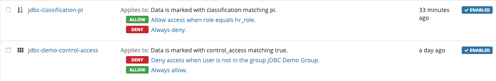

# Machina Tools for Java Demo (no encryption)

---

Machina Tools provides an easy-to-use interface to interact with Machina. In particular, Machina Tools exposes functions to create and manage data protection keys, tag them with attributes that can be used to inform policy, and to enable monitoring and audit key transactions.  Machina policy engine combines [*policy rules*](https://dev.ionic.com/tutorials/policy/create-data-policy), [*data markings*](https://dev.ionic.com/tutorials/policy/create-data-marking), and real-time information about every key request to provide complete control over access to protected data.

When a user wants to view protected data, a key request is sent to the tenant server.  This request identifies the client requesting the key to unlock the protected data.  The tenant software then validates the request against the policies in effect for the tenant.

Multiple policies may be evaluated in the context of a given key request.  This allows the server to make a fine-grained decision whether the key should be included in the response.

Machina allows for authorized users to update policies programmatically, via a set of web APIs.  The policies included in a web request might add specific new conditions for key release, or update or delete existing conditions.  The web API user must authenticate the request using an account that has the *Tenant Administrator* role.  An overview of the policy API is available [here](https://dev.ionic.com/api/policies).

This demo shows how to take advantage of the Machina Java SDK and APIs to control data access at the table or column level and to monitor/audit data by integrating the Machina Java SDK as part of a Java Database Connectivity (JDBC) application. With the use of key generation, data marking, policy updates and the use of Roles and Groups on the Machina platform to demonstrate the ability to control visibility, access and status tracking without requiring encryption/decryption.

When the user attempts to access the database, the application through the JDBC driver gets the Key Ids for each data column from the access table.  The application then requests the associated Keys for each Key Id. Table access is controlled based on the key's access control data marking, the user's group membership and the associated policy. If the user is not a member of the group identified by the group access policy no keys will be returned by the tenant blocking all access to the personnel table. Column access is controlled based on the key's column access data marking and whether the user owns the correct role for the matching role access policy.  Machina responds with allowed Keys based on these attributes, assignments and policies. The application uses the key response to determine what data can be obtained from the personnel table.

This README describes the components, setup, build steps and use of the demo app.

&nbsp;

## Before You Begin

---

Make sure you have the following prerequisites installed:

1. [Machina Java SDK](routes.gettingStarted.sdkSetup)
2. [Machina CLI](https://dev.ionic.com/tools)
2. [Git](https://git-scm.com/) distributed version control system
3. Java Runtime Environment 7+ (either [OpenJDK JRE](https://openjdk.java.net/install/index.html) or [Oracle JRE](https://www.oracle.com/technetwork/java/javase/downloads/index.html))
4. [Apache Maven](https://maven.apache.org/) (Java software project management tool)
5. A valid, plaintext [device enrollment profile](https://dev.ionic.com/getting-started/create-ionic-profile)

During the walk-through of this sample application, you will also need to download the following:

1. The [PostgreSQL binary](https://www.enterprisedb.com/download-postgresql-binaries) (see PostgreSQL Setup below).
2. The Git repository associated with [sample-jdbc-3 application](https://github.com/IonicDev/sample-jdbc-3.git) (see Download the JDBC Demo project next).

&nbsp;

## Download the JDBC Demo project

---

This git repository is set up to be compiled and run as a Maven project.

1. Open a *terminal* window.  Navigate to the base directory you want the project installed in.

```
cd ~
mkdir -p IonicJdbcDemo
cd IonicJdbcDemo
```

2. Clone the project from the IonicDev GitHub site.

```
git clone https://github.com/IonicDev/sample-jdbc-3.git
```

&nbsp;

## PostgreSQL Setup

---

&nbsp;

### Download and Unzip PostgreSQL Image

---

1. Download [PostgreSQL image](https://www.enterprisedb.com/download-postgresql-binaries). (This walk-through was prepared using version 10.11 of the Postgres software.  Replace the zip file name with your version, if different.)

2. Inflate PostgreSQL image into an empty folder on your filesystem.

```
cd ~/IonicJDBCDemo/
unzip -q ~/Downloads/postgresql-10.11-1-osx-binaries.zip
```

&nbsp;

### Initialize and Start Postgres Database

---

1. Navigate to the root folder of the unzipped PostgreSQL instance.

```
cd ~/IonicJDBCDemo/pgsql
```

4. Run the PostgreSQL initdb command to create the sample database with the administrative user 'postgres'. (If you select a different user name, make sure to adjust all following instructions appropriately.  Additionally, you will be prompted twice, during initialization, to enter/reenter a superuser password for the database.  The combination of the postgres administrator's user name and password will be needed for later use.)

```
bin/initdb -D data -U postgres -W -E UTF8 -A scram-sha-256
```

5. Run the PostgreSQL pg_ctl command to start the PostgreSQL server.

```
bin/pg_ctl -D data -l logfile start
```

&nbsp;

### Database Tables

---

#### Database Table [**personnel**]

For this structured data use case, we will model the first table **personnel** with several data fields associated with an employee record.  The data fields used for this example are first, last, zip and department.
- first: first name of employee
- last: last name of employee
- zip: home zip code for employee
- department: functional department employee works as member of

```
|  id  |    first    |    last     |     zip     | department  |
+------+-------------+-------------+-------------+-------------+
|  444 | Joseph      | Taylor      |       89104 | Marketing   |
|  445 | David       | Hernandez   |       68953 | Engineering |
|      |             |             |             |             |
```

During the demo, we will apply Ionic protection to two of these fields: *last* and *zip*.

#### Database Table [**access**]

A second table **access** will contain matching data fields to the ones in personnel.  The table will hold a single row containing a keyId for each of the data columns found in the access table.  The demo app will use these keyids to request the associated keys from the Machina tenant.

```
|  id  |    first    |    last     |     zip     | department  |
+------+-------------+-------------+-------------+-------------+
|    1 | DZtttttttt4 | DZttttttttU | DZttttttttw | DZttttttttM |
```

&nbsp;

### Create the Database Tables

---

1. Open a second *Terminal* window.  Navigate to the root folder of the unzipped PostgreSQL instance.

```
cd ~/IonicJDBCDemo/pgsql
```

2. Run the PostgreSQL psql command to enter the PSQL interactive command console with the user 'postgres'. You will need the password created during the PostgreSQL initialization step above.

```
bin/psql -U postgres
```

3. Create the Ionic JDBC Demo database tables using the CREATE TABLE commands from the file *examples/src/main/resources/jdbc/create.table.txt*. Create each table in a separate PSQL operation.

```shell
CREATE TABLE personnel(
id serial PRIMARY KEY,
first VARCHAR (64),
last VARCHAR (64),
zip VARCHAR (64),
department VARCHAR (64)
);

CREATE TABLE access(
id serial PRIMARY KEY,
first VARCHAR (64),
last VARCHAR (64),
zip VARCHAR (64),
department VARCHAR (64)
);
```

4. Verify table creations have been successful

- Verify personnel table created successfully

```shell
postgres=# select * from personnel;
 id | first | last | zip | department
----+-------+------+-----+------------
(0 rows)
postgres=#
```

- Verify access table created successfully

```shell
postgres=# select * from access;
 id | first | last | zip | department
----+-------+------+-----+------------
(0 rows)
postgres=#
```

&nbsp;

## JDBC Demo App Setup

---

&nbsp;

### Prepare JDBC demo properties file

---

1. Open a third *terminal* window.  Navigate to the root folder of the cloned Ionic JDBC Demo repository.

```
cd ~/IonicJDBCDemo/sample-jdbc-3
```

2. Edit the text file **examples/src/main/resources/demo.properties.xml**.
Substitute the values of the following configuration settings with values appropriate for your Ionic tenant.

```xml
  <!-- JDBC properties -->
  <entry key='driverClassName'>org.postgresql.Driver</entry>
  <entry key='jdbc.url'>jdbc:postgresql://localhost:5432/</entry>
  <entry key='jdbc.user'>postgres</entry>  <!-- substitute your postgres account here (default: postgres) -->
  <entry key='jdbc.password'>your-postgres-password</entry>  <!-- substitute your postgres account password here -->
```

**[driverClassName]**  JDBC driver to be loaded. Driver registers with JDBC. In our example we use the PostgreSQL JDBC Driver  
**[jdbc.url]**  JDBC references the database as an URL *jdbc:postgresql://host:port/*  
>*[host]* hostname of the server (defaults to localhost)  
>*[port]* port number server listens on (defaults to PostgreSQL standard port number (5432))  

**[jdbc.user]**  Administrative user from PostgreSQL database creation, defined with the -U option for dbinit above.  
**[jdbc.password]**  Password for the PostgreSQL Administrative user from the PostgreSQL database creation step above.  

```xml
  <!-- Ionic API properties -->
  <entry key='ionic.url'>https://api.ionic.com</entry>
  <entry key='ionic.tenantid'>aaaaaaaaaaaaaaaaaaaaaaaa</entry>  <!--substitute your Ionic tenant id here -->
  <!-- Ionic API Authorization Type (Basic | Bearer) -->
  <entry key='ionic.authorizationtype'>Basic</entry>
  <entry key='ionic.basic.user'>your-user-name</entry>  <!--substitute your Ionic tenant account user name here -->
  <entry key='ionic.basic.password'>your-user-password</entry>  <!--substitute your Ionic tenant account password here -->
  <entry key='ionic.bearer.apitoken'>
    AAAAAAAAAAAAAAAAAAAAAAAAAAAAAAAAAAAAAAAAAAAAAAAAAAAAAAAAAAAAAAAAAAAAAAAAAAAAAA
  </entry>  <!--substitute your Ionic tenant API token here -->
```

**[ionic.url]**  base URL for tenant commands  
**[ionic.tenantid]**  24-digit identifier assigned to the Ionic customer tenant.  
**[ionic.authorizationtype]**  method of user authentication. Currently 2 formats (Basic, Bearer).  See [Management APIs Authentication](https://dev.ionic.com/api/usage/authentication).  
>*Basic*:  Base 64 encoded token requiring User name and password. User name and password are combined with single colon ':' and resulting string is encoded using the RFC2045-MIME variant of Base64, except it is not limited to 76 characters per line.  

>*Bearer*:  (or OAuth 2.0 Authentication) Requires User Secret Token created during API Key creation.  

**[ionic.basic.user]** User name for Basic Authentication.  
**[ionic.basic.password]** User password for Basic Authentication.  
**[ionic.bearer.apitoken]**  User Secret Token for Bearer Authentication.

```xml
  <!-- Ionic JDBC app sample data -->
  <entry key='ionic.sampledata.userid'>555555555555555555555555</entry>  <!--substitute user ID for user requesting key here -->
  <entry key='ionic.sampledata.groupid'>444444444444444444444444</entry>  <!--substitute group ID for group to join here -->
  <entry key='ionic.sampledata.roleid'>333333333333333333333333</entry>  <!--substitute role ID for role to assign user here -->
```

**[ionic.sampledata.userid]** 24 digit identification for demo user.  
**[ionic.sampledata.groupid]** 24 digit identification for JDBC Demo Group.  
**[ionic.sampledata.roleid]**  24 digit identification for HR Role.

&nbsp;

### Build The Ionic JDBC Demo Application

---

1. On the third terminal window, navigate to the root folder of the cloned Ionic JDBC Demo repository.

```
cd ~/IonicJDBCDemo/sample-jdbc-3
```

2. Run the following maven command to build the Ionic JDBC jar:

```
mvn clean package install
```

3. Navigate to the examples folder of the Ionic JDBC Demo repository.

```
cd examples
```

4. Run the following command to build the Ionic JDBC Demo application:

```
mvn clean package install
```

&nbsp;

## Data Access Control

---

&nbsp;

### JDBC Demo Group

---

The Ionic JDBC Demo makes use of the **JDBC Demo Group** to help control general access to the database.


The **JDBC Demo Group** membership works with the *control_access* data marking, and the *jdbc-demo-control-access* policy to control whether a user is allowed general access to the tenant and database.  The jdbc-demo-control-access policy is invoked when a key's fixed attributes contains the data marking attribute control_access with the value "true." When invoked the jdbc-demo-control-access policy checks if the user is a member of the JDBC Demo Group.  If the user is a member of the JDBC Demo Group, then the user is allowed access to the database. If the user is not a member of the JDBC Demo Group, then the user will not be able to either display, or, make any changes to the database.

&nbsp;

### HR Role

---

The Ionic JDBC Demo makes use of the **HR Role** to help control access to Personal Information (pi) held in the database.


The **HR Role** is used to control access to any columns that have been marked with the *Personal Information (pi)* classification.  If the user has not been assigned the HR Role, then they will be blocked from displaying data in columns marked with the pi classification.  The user can see all other data fields but the pi columns will display the Restricted label instead of the underlying data.  Additionally, users that have not been assigned the HR Role are not permitted write access to the database if any column is marked with the pi classification.

&nbsp;

## JDBC Demo Policies

---

The Ionic JDBC Demo makes use of two policies. The *jdbc-demo-control-access* policy to control general database access. And the *jdbc classification-pi* policy to control column specific access to the database.



&nbsp;

### Group based control with jdbc-demo-control-access

---

The **jdbc-demo-control-access** policy works with the JDBC Demo Group and the control_access data marking to allow or deny general access to the database.  See the section *JDBC Demo Group* above.

The **control_access** data marking  works with the *JDBC Demo Group* and *jdbc-demo-control-access* to control general access to the tenant and the database.  When control_access is added to a key, as a fixed attribute with the value *true* any attempts to obtain the key will be controlled by the jdbc-demo-control-access policy, which validates whether the user is a member of the JDBC Demo Group.  If the user is a member of the JDBC Demo Group, then the policy will allow access. If not a member the policy will deny access. See the section *JDBC Demo Group* above.


&nbsp;

### Role based control with jdbc-sample-pi

---

The **jdbc-sample-pi** policy works with the HR Role and the classification data marking to control visibility and access to any columns in the personnel table that have been classified as containing Personal Information (pi) content.  When the key for a column has the key attribute classification with the value pi, the policy jdbc-sample-pi validates if the user has been assigned the HR Role and controls all attempts to display or write to the column and database appropriately. See the section *HR Role* above


&nbsp;

## JDBC Demo Keys and Attributes

---

&nbsp;

### Table [**access**]

---

The **access** table has one row created that contains the Key Ids for the keys that are used to control access to each of the matching data columns in the **personnel** table.

```
|  id  |    first    |    last     |     zip     | department  |
+------+-------------+-------------+-------------+-------------+
|    1 | DZtttttttt4 | DZttttttttU | DZttttttttw | DZttttttttM |
```

&nbsp;

### Fixed Attributes

---


On the third terminal window, execute the createAccessRecord command.

    ./run.sh createAccessRecord

This creates the access keys and generates the fixed attributes for each column in the database (control_access, classification, column_name).

&nbsp;

##### control_access

---

The control_access attribute, with the value 'true,' is assigned to each of the keys related to the keyIds stored in the access table.  This attribute invokes the jdbc-demo-control-access policy which only allows database access when the user is a member of the JDBC Demo Group.  If the user is not a member then key access is denied and the application does not execute any further action with the database.

    { "control_access": [ "true" ] }

&nbsp;

##### column_name

---

The column_name attribute is assigned with the associated column name for each Ionic key.  The column_name attribute ensures the matching of key and database column but does not itself add any further access control.  If a column is not also classified containing 'pi' content, the data in each of these columns is accessible if the user is a member of JDBC Demo Group per the jdbc-data-tracking fixed attribute.

    { "column_name": [ "department" ] }

&nbsp;

##### classification pi

---

If a column has been identified as containing 'pi' content, the associated key is assigned the attribute classification with the value 'pi.'  To access a column with the pi classification, the user must be a member of the JDBC Demo HR Group as well as a member of the JDBC Demo Group (per the control_access attribute above).

    { "classification": [ "pi" ] }

&nbsp;

## Run The JDBC Demo

---

In this demo the data fields "last" and "zip" were selected to be classified to contain "PI" content.

&nbsp;

### Add User to JDBC Demo Group

---

Log into your Tenant dashboard.
- Select the Groups tab.
- Verify your User is a member of the JDBC Demo Group


&nbsp;

### Add HR Role to User

---

Logged into your Tenant dashboard, select the Users tab.
- Click on the User's NAME link to select the user for this demo.
- Select the Update button to open the Update User dialog.
- In the Roles field enter "HR Role" to add the HR Role to the user.
- Select the Update button to confirm adding the HR Role.


&nbsp;

### Create Access Record

---

On the 3rd terminal, create the Access Record with the keyIds for each datafield.

    ./run.sh createAccessRecord

```shell
user:examples $ ./run.sh createAccessRecord
RowSet size: 0
Mar 17, 2020 3:54:56 PM com.ionic.samples.jdbc.IonicJdbcDemoApp createAccessRecord
INFO: 1
Create Access Record succeeded : 1 access record(s) created
```

On the 2nd terminal, verify the keyIds have been recorded.

    SELECT * FROM access;

```shell
postgres=# select * from access;
|  id  |    first    |    last     |     zip     | department  |
+------+-------------+-------------+-------------+-------------+
|    1 | DZtttttttt4 | DZttttttttU | DZttttttttw | DZttttttttM |
(1 row)
```

&nbsp;

### Create and Display Personnel Records

---

On the 3rd terminal, create and read Personnel Record(s).

    ./run.sh createPersonnelRecord
    ./run.sh readPersonnelRecord

```shell
user:examples $ ./run.sh createPersonnelRecord
RowSet size: 1
Keys: 4
Mar 23, 2020 7:59:05 PM com.ionic.samples.jdbc.IonicJdbcDemoApp createPersonnelRecord
INFO: 1
Create Personnel Record succeeded : 1 personnel record(s) created
user:examples $ ./run.sh readPersonnelRecord
RowSet size: 1
Keys: 4
Rows: 1
|------------|--------------|--------------|--------------|--------------|
| Personnel  | First        | Last         | Zip          | Department   |
|------------|--------------|--------------|--------------|--------------|
|            | Joseph       | Taylor       | 89104        | Marketing    |
|------------|--------------|--------------|--------------|--------------|
Read Personnel Records succeeded :
```

&nbsp;

### Remove User from Group

---

From the Tenant Dashboard.

- Select the Groups tab.
- Select the Group "JDBC Demo Group."
- Select the checkbox for your user.
- The "Remove" selector appears.
- Select the "Apply to Selected" button to remove the user from the JDBC Demo Group.
  


    
On the 3rd terminal, verify database access is prevented while the user is not a member of the JDBC Demo Group.

```shell
./run.sh createPersonnelRecord
./run.sh readPersonnelRecord

user:examples $ ./run.sh createPersonnelRecord
RowSet size: 1
There were no keys or access was denied to the keys
Create Personnel Record failed : There were no keys or access was denied to one or more keys
user:examples $ ./run.sh readPersonnelRecord
RowSet size: 1
There were no keys or access was denied to the keys
Read Personnel Records failed : There were no keys or access was denied to all keys
```

&nbsp;

### Restore the user as a member of the JDBC Demo Group

---

From the Tennant Dashboard. Add the user back to the JDBC Demo Group.

&nbsp;

### Demonstrate column specific access control

---

In this demo the field "last" and "zip" were chosen to be classified to contain "pi" content.  While generic access control made use of Group membership, this demonstration makes use of a User Role to control visibility and update capability for selected columns.

&nbsp;

#### Access while user has HR Role

---

With your selected user set as a member of both the "JDBC Demo Group" and the "JDBC Demo HR Group" attempt to read the personnel records.

    ./run.sh readPersonnelRecord

```shell
user:examples $ ./run.sh readPersonnelRecord
RowSet size: 1
Keys: 4
Rows: 20
|------------|--------------|--------------|--------------|--------------|
| Personnel  | First        | Last         | Zip          | Department   |
|------------|--------------|--------------|--------------|--------------|
|            | Joseph       | Taylor       | 89104        | Marketing    |
|            | David        | Hernandez    | 68953        | Engineering  |
|            | John         | Taylor       | 7441         | HR           |
|            | Mary         | Smith        | 4258         | Marketing    |
|            | Susan        | Jackson      | 85312        | HR           |
|            | Thomas       | White        | 46410        | Engineering  |
|            | John         | Martin       | 64172        | Engineering  |
|            | Joseph       | Wilson       | 98184        | Engineering  |
|            | Charles      | Brown        | 64840        | Marketing    |
|            | John         | White        | 76762        | HR           |
|            | Susan        | Jones        | 26210        | HR           |
|            | Joseph       | Jackson      | 4611         | HR           |
|            | Barbara      | Williams     | 36440        | Engineering  |
|            | David        | Hernandez    | 57969        | Marketing    |
|            | Elizabeth    | Martinez     | 2489         | Engineering  |
|            | Linda        | Miller       | 19153        | Engineering  |
|            | Jessica      | Smith        | 70627        | Marketing    |
|            | Patricia     | Brown        | 99067        | Marketing    |
|            | Michael      | Taylor       | 68965        | HR           |
|            | Karen        | Davis        | 83918        | Engineering  |
|------------|--------------|--------------|--------------|--------------|
Read Personnel Records succeeded :
user:examples $
```

Since the user is a member of both groups the application was able to read the database records.  If the user was not a member of the "JDBC Demo Group" no records would have been readable.  We'll explore what happens next, when the user is a member of the "JDBC Demo Group," but not a member of the "JDBC Demo HR Group."

&nbsp;

#### Access when user does not have HR Role

---

Logged into your Tenant dashboard
- Select the Users tab.
- Click on the User's NAME link to select the user for this demo.
- Select the Update button to open the Update User dialog.
- In the Roles field click on the x for "HR Role" to remove the HR Role from the user.
- Select the Update button to confirm removing the HR Role.


On the 3rd terminal, verify database access of pi classified data is blocked while the user is not a member of the JDBC Demo HR Group.

    ./run.sh readPersonnelRecord

```shell
user:examples $ ./run.sh readPersonnelRecord
RowSet size: 1
Keys: 2
Rows: 20
|------------|--------------|--------------|--------------|--------------|
| Personnel  | First        | Last         | Zip          | Department   |
|------------|--------------|--------------|--------------|--------------|
|            | Joseph       | RESTRICTED   | RESTRICTED   | Marketing    |
|            | David        | RESTRICTED   | RESTRICTED   | Engineering  |
|            | John         | RESTRICTED   | RESTRICTED   | HR           |
|            | Mary         | RESTRICTED   | RESTRICTED   | Marketing    |
|            | Susan        | RESTRICTED   | RESTRICTED   | HR           |
|            | Thomas       | RESTRICTED   | RESTRICTED   | Engineering  |
|            | John         | RESTRICTED   | RESTRICTED   | Engineering  |
|            | Joseph       | RESTRICTED   | RESTRICTED   | Engineering  |
|            | Charles      | RESTRICTED   | RESTRICTED   | Marketing    |
|            | John         | RESTRICTED   | RESTRICTED   | HR           |
|            | Susan        | RESTRICTED   | RESTRICTED   | HR           |
|            | Joseph       | RESTRICTED   | RESTRICTED   | HR           |
|            | Barbara      | RESTRICTED   | RESTRICTED   | Engineering  |
|            | David        | RESTRICTED   | RESTRICTED   | Marketing    |
|            | Elizabeth    | RESTRICTED   | RESTRICTED   | Engineering  |
|            | Linda        | RESTRICTED   | RESTRICTED   | Engineering  |
|            | Jessica      | RESTRICTED   | RESTRICTED   | Marketing    |
|            | Patricia     | RESTRICTED   | RESTRICTED   | Marketing    |
|            | Michael      | RESTRICTED   | RESTRICTED   | HR           |
|            | Karen        | RESTRICTED   | RESTRICTED   | Engineering  |
|------------|--------------|--------------|--------------|--------------|
Read Personnel Records succeeded :
user:examples $
```

Since the user is a member of the JDBC Demo Group, the user has general access to the database.  The database rows are able to be accessed and displayed.  Except, since the user does not have the HR Role assigned, the columns that have the classification pi data marking do not display the associated data.  Instead (for this display) the pi columns display a "RESTRICTED" replacement where the column's data would have been shown when the user had the HR Role.

&nbsp;

# Conclusion

---

Ionic Machina is powerful and flexible enough to be broadly applicable to the data protection needs of modern organizations.

This demo provides a simple JDBC example that uses Ionic Machina, without encryption, to control database visibility and auditing capabilities. This application demonstrates both general (table) and specific (column) based control of visibility and data changes. Through the dashboard this demonstration shows how these controls can be based on either group or role based policies. For clarity, this demo made use of very simple SQL statements, but points toward ease of implementation for more advanced data queries and controls.

For more information on taking advantage of encryption capabilities with structured data see Paul Grey's blog [Protecting Structured Data Using JDBC and Machina Tools for Java](https://ionic.com/protecting-structured-data-using-jdbc-machina-java-sdk/).

